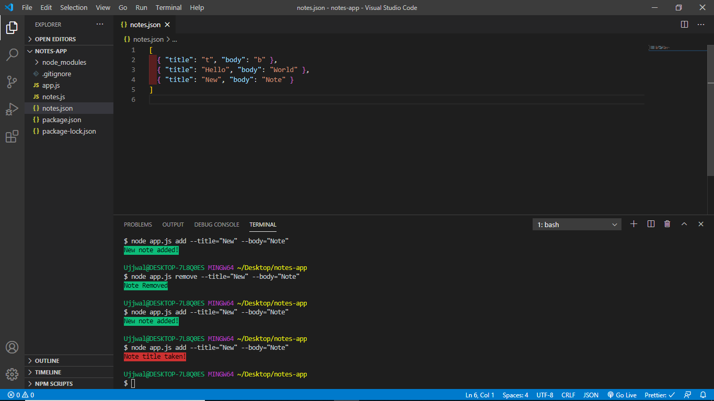

# Detail About Note App
## Note Taking App Using NodeJS 
### Chalk : Used for coloring terminal.
### Yargs : Used for creating terminal command.
### Nodemon : Used to detect live changes on terminal.

### ADD REMOVE LIST READ commands have been implemented in this app.

## To Start App
```bash
git clone 'this repo'
cd note-app
npm install
node app.js add --title="NewTitle" --body="NewBody"
```
## How App Interface Works




